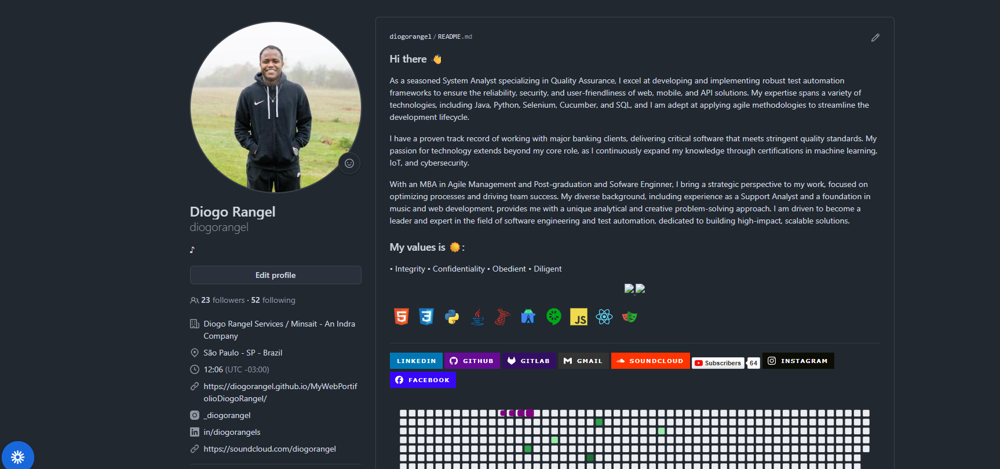

## 🌐 My Artificial Intelligence Projects 

## 🌐 Author : Diogo Rangel (@_diogorangel)
## 🌐 A Web Portfolio powered by HTML, CSS, JavaScript & AI (GPT + Gemini)

Este projeto é um portfólio web interativo criado para apresentar projetos relacionados a Inteligência Artificial, utilizando tecnologias simples (HTML, CSS e JavaScript) combinadas com APIs avançadas como OpenAI GPT e Google Gemini.
Funciona localmente e também ao vivo pelo GitHub Pages, permitindo demonstrar IA diretamente no navegador.
```bash
🚀 Funcionalidades

🎨 Interface moderna construída com HTML + CSS.

⚡ Interatividade dinâmica com JavaScript puro.

🤖 Integração com IA usando:

API OpenAI GPT (v4, v5, etc.)

API Google Gemini (1.5, Ultra, Flash etc.)

💡 Exemplos de aplicações que você pode incluir:

Chatbot inteligente

Resumo de textos

Geração de ideias

Explicação de código

Assistentes especializados (programação, estudo, produtividade etc.)

🌍 Rodando localmente e publicado no GitHub Pages

🔑 Suporte a chaves de API inseridas pelo usuário, sem backend.

📁 Estrutura do Projeto
/
|-- index.html
|-- style.css
|-- script.js
|-- /assets
|     |-- imagens, ícones, etc.
|-- README.md
'''
🛠️ Tecnologias Utilizadas
Tecnologia	Uso
HTML5	Estrutura do site
CSS3	Estilização e layout
JavaScript	Lógica e chamadas às APIs
OpenAI GPT API	Geração de texto/IA
Google Gemini API	Alternativa adicional de IA
GitHub Pages	Hospedagem do portfólio
🔧 Como Rodar Localmente

Baixe ou clone o repositório:

git clone https://github.com/diogorangel/My-Artificial-Intelligence-Projects.git


Abra o arquivo:

index.html


diretamente no navegador.

Insira suas chaves de API quando solicitado:

OpenAI API Key

Gemini API Key

Nenhum backend é necessário.
As requisições são feitas diretamente do navegador.

🔐 Configuração das API Keys

Como as chaves não ficam no repositório (por segurança), o usuário irá:

Inserir manualmente a OpenAI API Key no próprio site

Inserir manualmente a Gemini API Key no próprio site

As chaves ficam apenas em memória durante o uso e não são enviadas para nenhum servidor além das APIs oficiais.

🌎 Publicação no GitHub Pages

Vá em Settings > Pages

Em Source, selecione:

Deploy from branch


Escolha a branch principal (main) e a pasta /root (/)

Salve

Seu site ficará disponível em:

https://seu-usuario.github.io/My-Artificial-Intelligence-Projects/

🧠 Como Funciona a Integração com IA

Dentro do arquivo script.js, são feitas requisições como:
```bash
Exemplo OpenAI
const response = await fetch("https://api.openai.com/v1/chat/completions", {
  method: "POST",
  headers: {
    "Content-Type": "application/json",
    "Authorization": `Bearer ${openaiKey}`
  },
  body: JSON.stringify({
    model: "gpt-4o",
    messages: [{ role: "user", content: prompt }]
  })
});

Exemplo Gemini
const response = await fetch(
  `https://generativelanguage.googleapis.com/v1beta/models/gemini-pro:generateContent?key=${geminiKey}`,
  {
    method: "POST",
    headers: { "Content-Type": "application/json" },
    body: JSON.stringify({
      contents: [{ parts: [{ text: prompt }] }]
    })
  }
);
```
📸 Screenshots :



📌 Objetivo do Projeto

Este portfólio foi criado para:

Mostrar habilidades em web development

Demonstrar domínio de Inteligência Artificial aplicada

Servir como base para experimentos com IA

Criar um portfólio profissional e interativo

📄 Licença

Este projeto pode usar a licença que você desejar. Sugestão: MIT License.

💬 Contato

Se quiser adicionar uma seção de contato:

## 🌐Email: diodam.rangel@gmail.com

## 🌐LinkedIn: https://www.linkedin.com/in/diogorangels/

## 🌐 GitHub: https://github.com/diogorangel